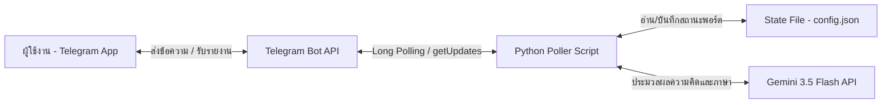

# Telegram Interactive AI Agent Framework (J.A.R.V.I.S. / F.R.I.D.A.Y. Style)

This skill provides the architecture, templates, and deployment guidelines for building a stateful, interactive AI Assistant on Telegram powered by Google's Gemini API and hosted on PythonAnywhere for 24/7 online availability.

## 1. System Architecture



---

## 2. Configuration Schema (`config.json`)

The state of the agent is stored in a simple JSON file. The Python script parses and modifies this state dynamically based on JSON commands returned by the Gemini API in the background.

```json
{
  "assistant_name": "F.R.I.D.A.Y.",
  "current_age": 49,
  "retirement_age": 60,
  "target_wealth": 1000000,
  "monthly_dca": 1000,
  "reminder_day": 10,
  "last_reminder_sent_month": "",
  "total_invested": 0.0,
  "holdings": {
    "KT-GESG-A": 0.0,
    "KT-BOND-A": 0.0
  },
  "last_nav": {
    "KT-GESG-A": 11.2,
    "KT-BOND-A": 10.5
  },
  "portfolio_funds": "1. กองทุนหุ้นโลกยั่งยืน (KT-GESG-A) - สัดส่วน 50% (เดือนละ 500 บาท)\n2. กองทุนตราสารหนี้คุณภาพสูง (KT-BOND-A) - สัดส่วน 50% (เดือนละ 500 บาท)",
  "telegram_bot_token": "YOUR_TOKEN",
  "telegram_chat_id": "YOUR_CHAT_ID",
  "gemini_api_key": "YOUR_GEMINI_KEY"
}
```

---

## 3. Resilient Poller Template (`jarvis_wealth_bot.py`)

A robust Python script featuring:
1. **Long Polling loop** for instant two-way chat.
2. **NAV Cache & Proxy Error Recovery** to survive PythonAnywhere free tier limitations.
3. **Proactive Reminder Engine** to trigger monthly notifications.
4. **Dynamic Config Updates & Transaction Tracking** via structured AI output.

```python
# Save in a folder with config.json and run via: python jarvis_wealth_bot.py
```

*Note: For the full source code, refer to the project file located at [jarvis_wealth_bot.py](file:///C:/Users/bkky9/RetirementWealthBot/jarvis_wealth_bot.py).*

---

## 4. Key Agent Control Instructions (AI System Prompts)

To trigger background actions from the chat, instruct Gemini in the system prompt to append JSON tags at the very end of its responses:

*   **For State/Config Updates:**
    `[UPDATE_CONFIG: {"key": value, ...}]`
*   **For Recording Transactions:**
    `[ADD_TRANSACTION: {"FUND_TICKER": amount_in_thb, ...}]`

The Python script automatically parses these tags, executes the corresponding JSON updates, saves the new state, and strips the tags from the final Telegram message.

---

## 5. Cloud Deployment Guide (PythonAnywhere Free Tier)

1.  Upload `jarvis_wealth_bot.py` and `config.json` to the `/home/username/` folder.
2.  Open **Consoles** -> **$ Bash** and install dependencies:
    `pip install pythainav requests`
3.  Launch the bot in the background:
    `python jarvis_wealth_bot.py`
4.  *(Optional)* Set up a daily cron task in the **Tasks** menu using:
    `python /home/username/jarvis_wealth_bot.py`
